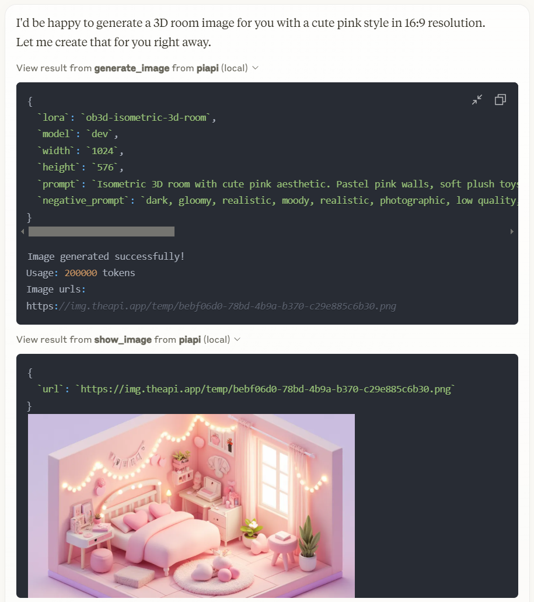

# piapi-mcp-server

[](https://piapi.ai)
[](https://piapi.ai/docs)
[](https://discord.gg/qRRvcGa7Wb)

[](https://smithery.ai/server/piapi-mcp-server)

A TypeScript implementation of a Model Context Protocol (MCP) server that integrates with PiAPI's API. PiAPI makes user able to generate media content with Midjourney/Flux/Kling/LumaLabs/Udio/Chrip/Trellis directly from Claude or any other MCP-compatible apps.

<a href="https://glama.ai/mcp/servers/ywvke8xruo"></a>

## Features (more coming soon)

Note: Time-consuming tools like video generation may not complete due to Claude's timeout limitations

- [x] Base Image toolkit
- [x] Base Video toolkit
- [x] Flux Image generation from text/image prompt
- [x] Hunyuan Video generation from text/image prompt
- [x] Skyreels Video generation from image prompt
- [x] Wan Video generation from text/image prompt
- [x] MMAudio Music generation from video
- [x] TTS Zero-Shot voice generation
- [ ] Midjourney Image generation
  - [x] imagine
  - [ ] other
- [x] Kling Video and Effects generation
- [x] Luma Dream Machine video generation
- [x] Suno Music generation
- [ ] Suno Lyrics generation
- [ ] Udio Music and Lyrics generation
- [x] Trellis 3D model generation from image
- [ ] Workflow planning inside LLMs

## Working with Claude Desktop Example



## Prerequisites

- Node.js 18.15+ for the legacy server; **Node.js 20+** for the MCP Apps preview entry
- npm or yarn
- A PiAPI API key (get one at [piapi.ai](https://piapi.ai/workspace/key))

## Installation

### Installing via Smithery

To install PiAPI MCP Server for Claude Desktop automatically via [Smithery](https://smithery.ai/server/piapi-mcp-server):

```bash
npx -y @smithery/cli install piapi-mcp-server --client claude
```

### Manual Installation
1. Clone the repository:

```bash
git clone https://github.com/apinetwork/piapi-mcp-server
cd piapi-mcp-server
```

2. Install dependencies:

```bash
npm install
```

3. Build the project:

```bash
npm run build
```

After building, a `dist/index.js` file will be generated. You can then configure this file with Claude Desktop and other applications. For detailed configuration instructions, please refer to the Usage section.

4. (Optional) Test server with MCP Inspector:

First, create a `.env` file in the project root directory with your API key:

```bash
PIAPI_API_KEY=your_api_key_here
```

Then run the following command to start the MCP Inspector:

```bash
npm run inspect
```

After running the command, MCP Inspector will be available at http://localhost:5173 (default port: 5173). Open this URL in your browser to start testing. The default timeout for inspector operations is 10000ms (10 seconds), which may not be sufficient for image generation tasks. It's recommended to increase the timeout when testing image generation or other time-consuming operations. You can adjust the timeout by adding a timeout parameter to the URL, for example: http://localhost:5173?timeout=60000 (sets timeout to 60 seconds)

The MCP Inspector is a powerful development tool that helps you test and debug your MCP server implementation. Key features include:

- **Interactive Testing**: Test your server's functions directly through a web interface
- **Real-time Feedback**: See immediate results of your function calls and any errors that occur
- **Request/Response Inspection**: View detailed information about requests and responses
- **Function Documentation**: Browse available functions and their parameters
- **Custom Parameters**: Set custom timeout values and other configuration options
- **History Tracking**: Keep track of your previous function calls and their results

For detailed information about using the MCP Inspector and its features, visit the [official MCP documentation](https://modelcontextprotocol.io/docs/tools/inspector).

## Usage

### Connecting to Claude Desktop

Add this to your Claude Desktop configuration file (`~/Library/Application Support/Claude/claude_desktop_config.json` on macOS or `%APPDATA%\Claude\claude_desktop_config.json` on Windows):

```json
{
  "mcpServers": {
    "piapi": {
      "command": "node",
      "args": ["/absolute/path/to/piapi-mcp-server/dist/index.js"],
      "env": {
        "PIAPI_API_KEY": "your_api_key_here"
      }
    }
  }
}
```

After updating your configuration file, you need to restart Claude for Desktop. Upon restarting, you should see a hammer icon in the bottom right corner of the input box.
For more detailed information, visit the [official MCP documentation](https://modelcontextprotocol.io/quickstart/user)

### Connecting to Cursor

Note: Following guide is based on Cursor 0.47.5. Features and behaviors may vary in different versions.

To configure the MCP server:

1. Navigate to: File > Preferences > Cursor Settings, or use the shortcut key `Ctrl+Shift+J`
2. Select "MCP" tab on the left panel
3. Click "Add new global MCP server" button in the top right
4. Add your configuration in the opened mcp.json file

```json
{
  "mcpServers": {
    "piapi": {
      "command": "node",
      "args": ["/absolute/path/to/piapi-mcp-server/dist/index.js"],
      "env": {
        "PIAPI_API_KEY": "your_api_key_here"
      }
    }
  }
}
```

5. After configuration, you'll see a "piapi" entry in MCP Servers page
6. Click the Refresh button on the entry or restart Cursor to connect to the piapi server

To test the piapi image generation:

1. Open and select "Agent mode" in Cursor Chat, or use the shortcut key `Ctrl+I`
2. Enter a test prompt, for example: "generate image of a dog"
3. The image will be generated based on your prompt using piapi server

To disable the piapi server:

1. Navigate to the MCP Servers page in Cursor Settings
2. Find the "piapi" entry in the server list
3. Click the "Enabled" toggle button to switch it to "Disabled"

## Keeping tools in sync with PiAPI (sync task)

`src/index.ts` registers a contract-backed MCP tool for **every** committed
PiAPI `(model, task_type)` capability.  Tool names are deterministic:
`piapi_<model>_<task_type>` (for example,
`piapi_qubico_flux1_schnell_txt2img`), and their input schemas are generated
from the committed catalog.  The existing hand-written convenience tools remain
available; the contract-backed tools ensure the exposed surface stays complete
as the Manager catalog changes.

The legacy convenience tools in `src/index.ts` remain hand-written, but the
complete contract-backed surface is generated from the committed catalog. This
repository includes a repeatable **drift detector** that compares that catalog
baseline with PiAPI Manager's versioned API contract. It detects **new APIs**,
**deprecated APIs**, **parameter changes**, and **description changes**.

**Source of truth:** the `Go API.postman_collection.json` contract in the PiAPI
Manager GitHub repository (`Gocyber-world/midjourney-http-v2`). The task fetches
that versioned contract directly from GitHub and extracts the
`POST /api/v1/task` examples into `(model, task_type)` capabilities. If the
Manager repository is private, set the CI secret `MCP_SYNC_GITHUB_TOKEN` with
least-privilege `contents: read` on that source repository (and only the
separate approved write permissions needed for MCP update automation). It has
no Apidog dependency and deliberately does **not** inspect or report pricing.

### Commands

```bash
npm run build          # compile the MCP server and sync task
npm run test:sync      # offline sync-engine tests (no network or credentials)
npm run sync           # fetch contract and diff baseline; exit 0 = in sync, 2 = drift
npm run sync:snapshot  # print the normalized current contract catalog
npm run sync:report    # write the Markdown drift report to sync-report.md
npm run sync:accept    # after updating src/index.ts, refresh the baseline
```

By default, `npm run sync` uses the Manager GitHub contract. For recovery or
local development, an exported OpenAPI JSON file can be supplied instead:

```bash
node dist/sync/cli.js diff --file ./piapi-openapi.json
```

When a drift report is produced, a new capability is already represented by its
contract-backed MCP tool after the baseline is accepted. Validate the MCP
server, run `npm run sync:accept`, and commit the refreshed baseline. Update a
hand-written convenience tool only when a curated model-specific UX is useful.

### Automation

`.github/workflows/sync-piapi.yml` is retained for manual dispatch only.
Periodic synchronization is run from the approved local automation environment,
which holds the separately owner-approved MCP credential and can validate,
accept, and push catalog updates after its sensitive-information gate passes.

## Development

### Project Structure

```
piapi-mcp-server/
├── assets/
├── src/
│   ├── index.ts        # Main server entry point
│   └── sync/           # PiAPI -> MCP sync task
│       ├── cli.ts          # CLI: snapshot / diff / accept / report-file
│       ├── fetchers.ts     # GitHub Postman contract + local-file sources
│       ├── normalize.ts    # OpenAPI -> (model, task_type) catalog
│       ├── diff.ts         # catalog diff + Markdown report
│       ├── catalog.ts      # baseline load/save
│       ├── mcp_tools.ts    # catalog -> contract-backed FastMCP tool schemas
│       ├── selftest.ts     # offline engine test (npm run test:sync)
│       ├── types.ts
│       └── baseline.piapi-catalog.json  # committed baseline
├── .github/workflows/sync-piapi.yml     # weekly drift check
├── package.json
├── tsconfig.json
└── .env.example
```

## License

MIT

## MCP Apps media preview (modern entry, preview)

The existing `dist/index.js` FastMCP/stdio entry remains the compatibility path for
current users. It keeps the existing tool names and text result behavior.

For MCP hosts that implement **MCP Apps**, build the modern entry and configure the
client to run `modern/dist/modern/src/index.js`. It exposes the committed PiAPI catalog
and a generic `piapi_run_task` tool. Tools return a text fallback, structured media
metadata, resource links, and a `ui://piapi/media-gallery` resource. Compatible hosts
can render images, videos, audio, and recognized 3D assets inline; other hosts retain
links that can be opened or downloaded.

```bash
npm install
(cd modern && npm install)
npm run build:all
```

`npm run build` remains the legacy-only build command for existing users. The modern entry still uses `PIAPI_API_KEY` from the environment. It never provides
that key to the UI. By default the gallery only permits `https://piapi.ai` and
`https://*.piapi.ai` as embedded media origins. Operators can explicitly extend the
allowlist for their approved artifact CDN domains with:

```bash
PIAPI_MEDIA_RESOURCE_DOMAINS="https://cdn.piapi.ai,https://media.example.com"
```

For a separate hosted viewer fallback, set the optional HTTPS-only
`PIAPI_MEDIA_VIEWER_BASE_URL`; the server will add the task ID as a query parameter.
The viewer base cannot include credentials, a query string, or a fragment; the
MCP Apps UI never supplies it with a raw artifact URL or the PiAPI key.
Remote HTTP/OAuth deployment for ChatGPT or other hosted clients is intentionally a
separate concern from this local stdio entry.

See [`modern/docs/host-compatibility.md`](modern/docs/host-compatibility.md) for
the current host verification matrix, the repeatable stdio protocol smoke test,
and safe isolated-profile guidance for a visual Claude Desktop check. For
local mock testing only, the modern executable accepts `PIAPI_API_BASE_URL`;
it accepts HTTPS endpoints and limits plain HTTP to `localhost` or
`127.0.0.1`. The separately versioned
[`PiAPI media result profile`](modern/docs/piapi-media-result-profile.md)
documents which Manager result fields can be embedded by the gallery. Recognized
`.glb` output has an inline MCP Apps preview with a download-link fallback; see
[`modern/docs/three-d-preview.md`](modern/docs/three-d-preview.md).

## Remote HTTPS / OAuth deployment

The modern package now also exposes a reusable authenticated Streamable HTTP
handler for hosted MCP clients. It is deliberately a resource-server building
block, not a bundled authorization server: PiAPI account OAuth, token
verification, and tenant-to-credential lookup must be supplied by the
deploying service. See
[`modern/docs/remote-oauth.md`](modern/docs/remote-oauth.md) for the required
security boundaries and integration contract.
